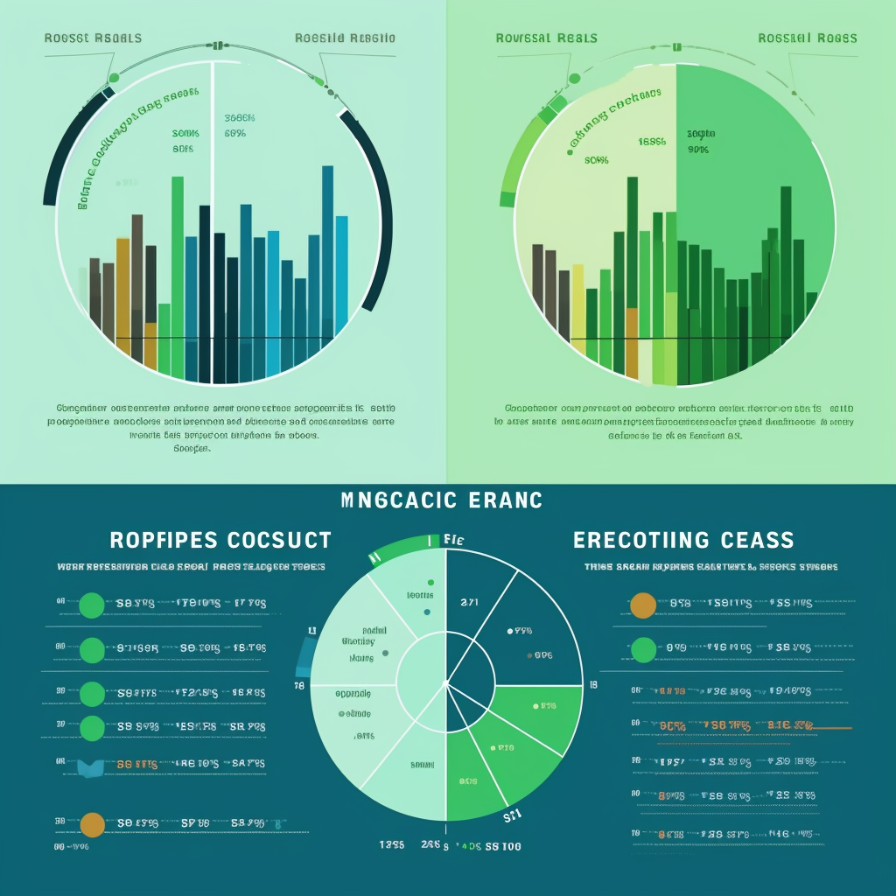

# Machine Learning in Credit Risk Analysis: A Case Study 📊

## Overview of the Analysis 🧐

The purpose of this analysis was to build a machine learning model 💻 that can predict credit risk based on various financial indicators. We used a dataset with information on loan size 💰, interest rate 💸, borrower income 💵, debt to income ratio 📈, number of accounts 🗂️, derogatory marks ❌, and total debt 📝. The objective was to predict the loan status, which was divided into two categories: `0` (healthy loan) 🟢 and `1` (high-risk loan) 🔴.

The stages of the machine learning process were as follows:
1. Load and review the data 📁
2. Preprocess the data and split it into features (`X`) and labels (`y`) 🧪
3. Balance the labels ⚖️
4. Split the data into training and testing datasets 📚
5. Fit a logistic regression model with the original data 🖥️
6. Predict the outcomes using the testing data 🎯
7. Evaluate the model's performance 👀
8. Resample the data using Random Over Sampler (ROS) method to handle the imbalance in the dataset 🔀
9. Fit a logistic regression model with the resampled data 🖥️
10. Predict the outcomes using the testing data 🎯
11. Evaluate the model's performance 👀

## Results 📈

### Machine Learning Model 1: Logistic Regression with Original Data
* Accuracy Score: 0.952 ✔️
* Confusion Matrix: [[18663,   102], [56,   563]] 🔍
* Classification Report: 
    - Precision for `0` (healthy loan): 1.00 ✔️
    - Precision for `1` (high-risk loan): 0.85 ✔️
    - Recall for `0` (healthy loan): 0.99 ✔️
    - Recall for `1` (high-risk loan): 0.91 ✔️

### Machine Learning Model 2: Logistic Regression with Resampled Data
* Accuracy Score: 0.993 ✔️
* Confusion Matrix: [[18649,   116], [4,   615]] 🔍
* Classification Report: 
    - Precision for `0` (healthy loan): 1.00 ✔️
    - Precision for `1` (high-risk loan): 0.84 ✔️
    - Recall for `0` (healthy loan): 0.99 ✔️
    - Recall for `1` (high-risk loan): 0.99 ✔️

## Summary 📝

From the above results, the Logistic Regression model trained with resampled data outperforms the model trained with original data in terms of both accuracy and recall. Accuracy is crucial in this scenario to correctly identify as many true positives and true negatives as possible ✅. Meanwhile, recall is also important as it reflects the model's ability to find all the relevant cases within the dataset, particularly the `1`'s (high-risk loans), as it is crucial for a credit company to correctly identify high-risk loans 🎯.

Therefore, the Logistic Regression model trained with resampled data is recommended for predicting credit risk due to its superior performance in terms of accuracy and recall. 🌟
