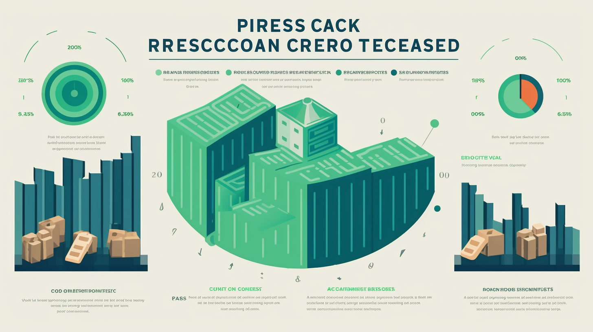
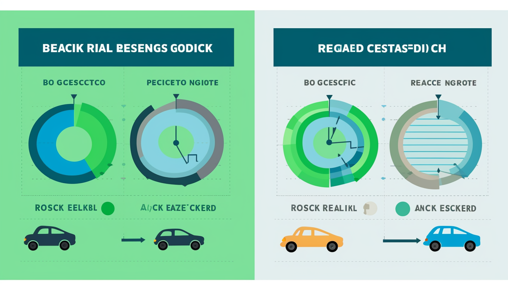

##### Module-12-Challenge

# **💳 Credit Risk Classification: Unmasking Risky Loans 💼**
Hello, financial wizards! 🧙‍♂️ Welcome to our project, where we deep-dive into the abyss of credit risk! This is a challenge that takes us through the land of imbalanced classes. By applying various techniques, we'll train and evaluate models and bring balance to the (data) force.

The purpose is to leverage a historical dataset of lending activity from a peer-to-peer lending services company to craft a model that accurately identifies the creditworthiness of borrowers. Healthy loans outnumber risky loans, but fear not! With our trusty data science tools, we're up for the task! 🦸‍♀️

# **🧭 Instructions:**
Follow these steps and join us on this adventure!

## **🚂 Split the Data into Training and Testing Sets**

1. Import the **lending_data.csv** data from the **Resources** folder into a Pandas DataFrame.
2. Craft the labels set (**y**) from the "loan_status" column, then create the features (**X**) DataFrame from the remaining columns.
   - 🚨 A value of 0 in the "loan_status" column means the loan is healthy. A value of **1** signifies a high risk of defaulting. 🚨
3. Gauge the balance of the labels variable (**y**) using the **value_counts** function.
4. Slice and dice the data into training and testing datasets using **train_test_split**.

## **🧪 Create a Logistic Regression Model with the Original Data**
Time to put logistic regression to the test!

1. Fit a logistic regression model using the training data (**X_train** and **y_train**).
2. Stow away the predictions on the testing data labels using the testing feature data (**X_test**) and the newly fitted model.
3. Evaluate our model's performance:
   - Compute the accuracy score of the model.
   - Generate a confusion matrix.
   - Print the classification report.
4. Contemplate this question: How effectively does the logistic regression model predict both the **0 **(healthy loan) and** 1** (high-risk loan) labels?

## **🔄 Predict a Logistic Regression Model with Resampled Training Data**
Notice the scarcity of high-risk loan labels? Perhaps, a model that uses resampled data will perform better. We're going to give it a shot!

1. Utilize the **RandomOverSampler** module from the imbalanced-learn library to resample the data. Ensure the labels have an equal number of data points. 🏷️
2. Employ the **LogisticRegression** classifier and the resampled data to fit the model and make predictions.
3. Evaluate our model's performance:
   - Calculate the accuracy score of the model.
   - Generate a confusion matrix.
   - Print the classification report.
4. Ponder this question: How well does the logistic regression model, fit with oversampled data, predict both the **0** (healthy loan) and **1** (high-risk loan) labels?

## **📝 Write a Credit Risk Analysis Report**
Finally, create a concise report that encapsulates the performance of both machine learning models used in this challenge. Structure the report using the report template in Starter_Code.zip, ensuring it includes:

1. An overview of the analysis: Elucidate the purpose of this analysis.
2. The results: Use bulleted lists to describe the balanced accuracy scores and the precision and recall scores of both machine learning models.
3. A summary: Summarize the results from the machine learning models. Contrast the two versions of the dataset predictions. Include your recommendation for the model to use, if any, on the original vs. the resampled data. If you don’t recommend either model, substantiate your reasoning.

# **💡 Have fun and learn lots!**
This project is designed to make credit risk analysis an exciting adventure, with lots of learning on the go. At the end of the day, we want to ensure credit risk does not remain an uncharted territory. So put on your data scientist hat 🎩, embark on this expedition 🚀, and let's demystify credit risk together!

Stay curious, stay hungry. Happy analyzing! 🎉
